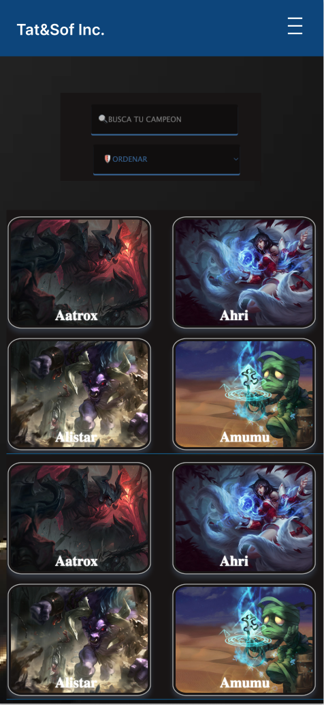

# Data Lovers

## Índice

* [1. Definición de Producto](#1-definición-de-producto)
* [2. Historias de Usuario](#2-historias-de-usuario)
* [3. Diseño de la Interfaz de Usuario](#3-diseño-de-la-interfaz-de-usuario)

***

## 1. Definición de producto

  * **Usuario Objetivo:** El producto va dirgido a aquellas personas nuevas en el mundo de los videojuegos las cuales podrían estar interesadas en conocer de que se trata el juego y sus personajes. 

  * **Esquema general:** La aplicación web contará con las siguientes secciones:

    1. **Página inicial:** En ella se define un menú el cual estará fijado para permitir la navegación por la página, también, se describe un mensaje de bienvenida para el nuevo jugador y una breve descripción de lo qué es el juego, así mismo, la página inicial se complementa con un botón que invita al nuevo usuario a conocer más si se encuentra interesado.

    2. **Segunda página:** En ella se describen 5 conceptos principales que catalogamos como: (“lo que debes saber”) en referencia al juego, si el usuario se encuentra completamente interesado, cuenta con un botón denominado “Conoce los Campeones”, el mismo, le permitirá acceder a conocer cada personaje con sus diferentes características.

    3. **Tercera página:** En ella se cuenta con una opción para buscar el personaje digitando su nombre, un campo para ordenar todos los personajes de la A-Z y de la Z-A y un botón llamado “ROLES” el cual nos muestra 6 roles: Asesinos, Luchadores, Tiradores, Magos, Apoyos y Tanques. Al dar clic sobre cada rol se encontrarán agrupados todos los personajes que pertenecen a ese rol.  

    También se puede visualizar cada personaje con su respectiva imagen y nombre. Al dar clic sobre cada uno, se mostrará una ventana donde se podrá observar información más detallada del personaje como su título y su nivel de poder en habilidades como defensa y ataque.

    4. **Cuarta página:** En ella se describe información adicional como estadísticas donde por medio de tarjetas se muestra al usuario el promedio de “Daño en ataque”, “Bloque de hechizos” y “Velocidad de ataque por nivel” para la totalidad de los personajes.

## 2. Historias de Usuario

  - *Historia de usuario 1*
  

  - *Hisotria de usuario 2*
    

  - *Historia de usuario 3*
    

  - *Historia de usuario 4*
    

  - *Historia de usuario 5*
    

## 3. Diseño de la Interfaz de Usuario

 * **Prototipo de baja fidelidad**

   - **Historia de Usuaria 1:** página de Bienvenida e información adicional sobre LOL.

    
  
    

  - **Historia de Usuaria 2 y 3:** visualización de todos los campeones y opciones para buscar y ordenar.

    

  - **Historia de Usuaria 4:** visualización de roles y opción de filtrado de campeones por rol. 
    

    - **Historia de Usuaria 5:** presentación de datos estadistico a traves de tarjetas.
    

 * **Prototipo de alta fidelidad**

  - **Bienvenida** Página de bienvenida que invitará al usuario por medio de un corto mensaje a conocer más sobre LOL.

  

  - **Conoce más** En la página "Conoce más" el nuevo usuario podrá encontrar toda la información necesaria para comenzar su interacción con LOL.

  

  - **Conoce los Campeones** Página en la que el nuevo usuario podrá encontrar las imágenes de cada campeón, así mismo, ordenar alfabeticamente, buscar por nombre al campeón deseado y al hacer click sobre la foto de cualquier campeón conocer más atributos del mismo.

  

  - **Estadísticas** Página en la que el nuevo usuario podrá conocer 2 de las estadísticas más importantes de LOL.

  

 * **Testeos de Usabilidad**

 - *Testeos generales* 

Testeamos nuestra aplicación con 5 usuarios externos de lABORATORIA, todo esto con el fin de tener unos testeos impecables y con usuarios no conocedores, a continuación los resultados que recibimos:

*Link Google Forms* https://forms.gle/vMBoiJ6YLLivLrCZ8

   - *Análisis:* En las primeras dos preguntas que se muesran a continuación, podemos evidenciar que los usuarios que testearon nuestra aplicación se encuentran conformes con el proceso de navegación y el objetivo del mensaje de bienvenida:

  
  

  - *Análisis:* En la pregunta "¿Fue fácil utilizar el menú desplegable?", el 80% de los usuarios respondieron de    forma afirmativa.

  *Problema encontrado:* El 20% responde que no fue sencillo navegar en el mismo.

  *Solución:* Al verificar los resultados, evidenciamos que nos hizo falta adaptar una respuesta tipo párrafo para conocer el motivo de esta respuesta, ya que hemos testeado nuestra aplicación en varios dispositivos y funciona bien, sin embargo, entramos a revisar de nuevo nuestro menú desplegable asegurándonos de que todo funcione correctamente:

  

  - *Análisis:* A las siguientes tres preguntas que abarcan las historias 1 y 2 de nuestro proyecto recibimos una respuesta afirmativa:

  

  

  

  - *Análisis:* A la pregunta "¿Si estuvo interesado en acceder a información adicional por campeón, fue sencillo acceder a ella?", el 60% indicó que si estuvo interesado y si fue sencillo acceder a la información.

  *Problema:* El 40% restante indicó no haber estado interesado.

  *Solución:* Verificamos cada parte que invita al usuario a conocer más e hicimos algunos ajustes de texto y demás, sin embargo, también tuvimos en cuenta que es probable que sencillamente el usuario no se encuentre interesado en conocer más ya que no es algo que manejen cotidianamente o tengan presente en la base de su entretenimiento:

  

  - *Análisis:* A la pregunta "¿Si estuvo interesado en acceder a los roles por campeón, fue sencillo acceder a esto?", el 80% indicó que si estuvo interesado y si fue sencillo acceder a la información.

  *Problema:* El 20% restante indicó no haber estado interesado.

  *Solución:* Verificamos cada parte que invita al usuario a conocer más sobre los roles e hicimos algunos ajustes de texto y demás, sin embargo, también tuvimos en cuenta que es probable que sencillamente el usuario no se encuentre interesado en conocer más ya que no es algo que manejen cotidianamente o tengan presente en la base de su entretenimiento:

  

  - *Análisis:* A la pregunta "¿Logró ver los campeones que pertenecen a cada Rol?", el 80% indicó que si logró ver esta información solicitada.

  *Problema:* El 20% restante indicó no haber estado interesado.

  *Solución:* Verificamos que el botón de "Roles" sea llamativo y adecuado para que el usuario ingrese a verificar esta información, encontramos todo funcionando de manera correcta, sin embargo, también tuvimos en cuenta que es probable que sencillamente el usuario no se encuentre interesado en los roles  ya que no es algo que manejen cotidianamente o tengan presente en la base de su entretenimiento:

  

  - *Análisis:* A la pregunta "¿Fue fácil acceder a las estadísticas de la aplicación?", el 60% indicó que si logró acceder esta información de manera sencilla.

  *Problema:* El 20% restante indicó que el proceso no fue sencillo, indagando un poco más evidenciamos que la persona que respondió esto no pudo hacer uso de la funcionalidad de movilizar el cursor sobre la imágen para que la misma rotara y pudiera validar las estadísticas, es el único usuario que reporta este error, así bien, un usuario más indica que en su concepto son pocas estadísticas.

  *Solución:* Verificamos el correcto funcionamiento en varios dispositivos y no encontramos error alguno, así mismo, en cuanto a la valiosa observación del usuario que manifiesta la poca cantidad de estadísticas por el momento por motivos de tiempo no podemos acceder a sus peticiones e implementar más estadísticas por el momento, pero, serán implementadas a futuro:

  